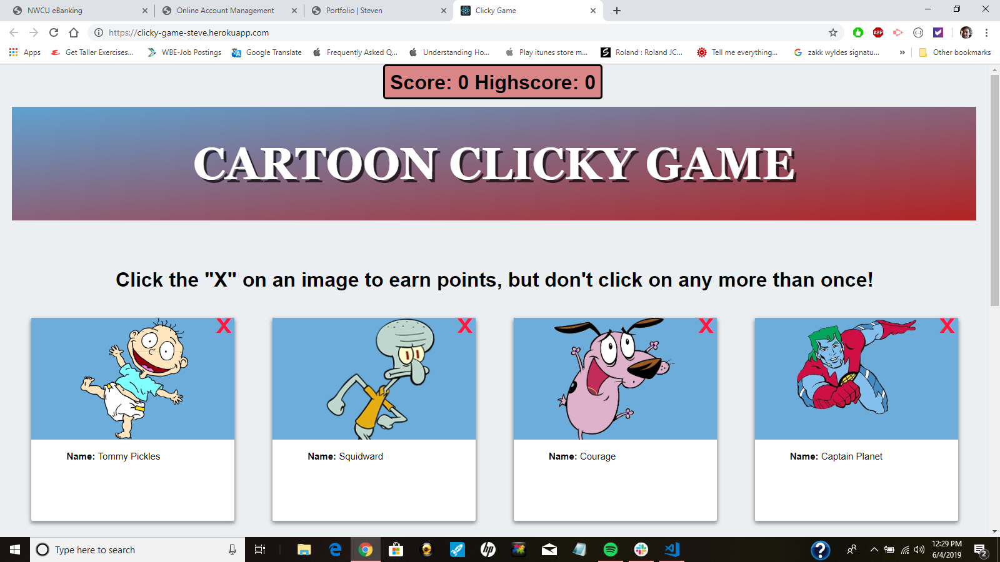
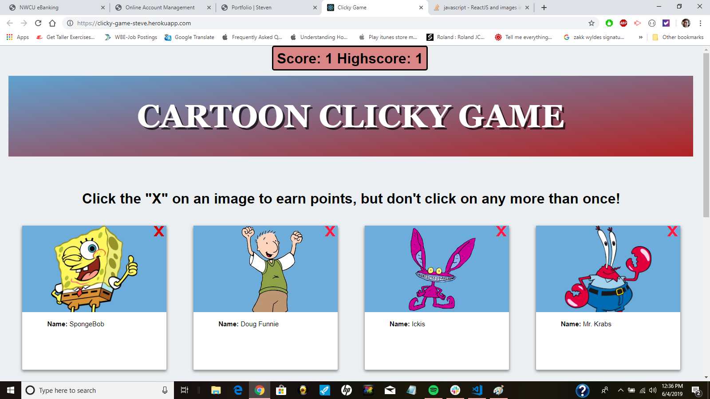
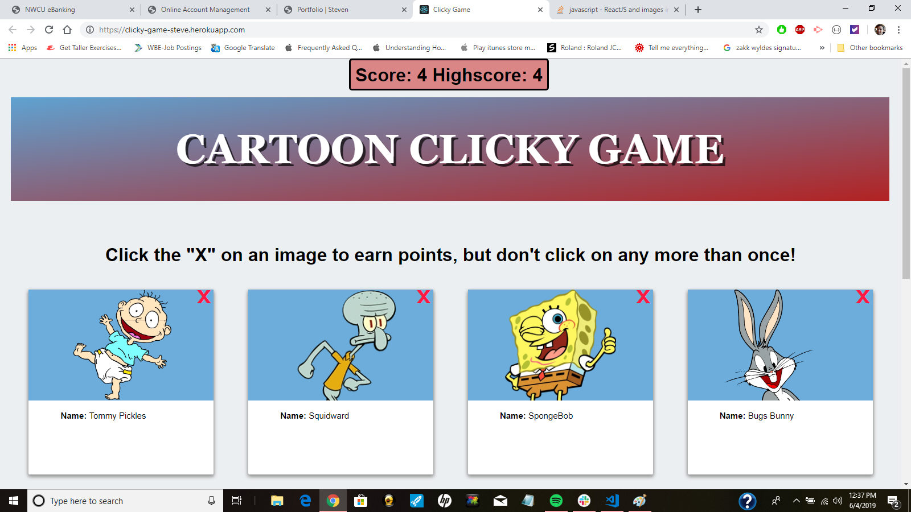
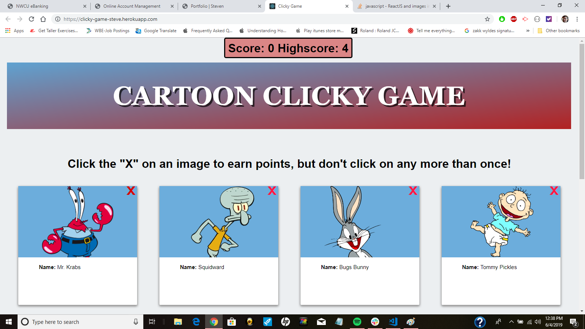

# Cartoon Clicky Game

In this application I used REACT to great a dynamic clicky game. REACT uses JSON data and JSX to manipulate HTML for its code. To put it simply REACT is a JavaScript library. I can make changes live without having to reload the web browser because of REACT's DOM manipulation. CSS was added for styling. 

This application renders different images to the screen. Each cartoon character image listens for click events on its "X" in the upper right corner.  All of the movement is happening dynamically by using several components.  This way the app moves quicker.

**Example 1** This application is one page.  The landing page shows "Score" and "Highscore." The object of the game is to click a character to increase your score.  If a user clicks the same character twice then the score will reset to 0. Try to avoid clicking the same cartoon character twice to set a "Highscore." There are 12 characters on the screen, therefore 12 is the highest score than can be achieved.

**Example 2**  I have clicked "Tommy Pickles" and now all the characters have reshuffled.  "Tommy Pickles" has moved to a new a spot. I have a score of 1 and since I've just started this game I have set the highest score to 1.

**Example 3** I have gotten my score up to 4 and have set the highest score to 4.  However what happens if I click "Tommy Pickles" again?

**Example 4** I clicked "Tommy Pickles" again and my score was reset to 0 and all the characters are reshuffled.  The highest score is still set to 4 because that is the highest number achieved while I played the game. If I reload the browser it would reset the score and highest score back to 0.    

# Conclusion

This application shows my use of REACT to render dynamically moving images on a screen.  It also shows the use of JavaScript functions and logic to create a game.  REACT is the same technology used by Facebook to create a fast easy user experience. Changes happen live without making http requests. This is modern Front-End Development at its best.

1. deployed site: https://clicky-game-steve.herokuapp.com/
2. previous version of game: https://sdytewski.github.io/clicky-game/

